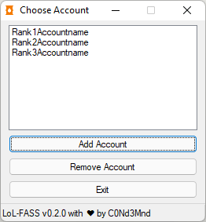

# LoL-FASS

*L(eague) o(f) L(egends) F(ast) A(ccount) S(witching) S(cript)*

AutoHotkey script to switch between multiple League of Legends accounts quickly (including dodging games).

## Setup

1. Download the latest release from the [releases page](https://github.com/C0Nd3Mnd/LoL-FASS/releases) and extract the archive somewhere
2. Open the `settings.ini` in a text editor (Notepad is fine) and edit the `[Accounts]` section to contain your account details
3. If you installed League of Legends in a different path than `C:\Riot Games`, adjust the path (it's the path to the `Riot Games` folder containing the `Riot Client` folder); do not include a trailing slash
4. Launch `fass.exe` every time you want to switch accounts

## Usage

Launch `fass.exe` and double-click on the account you want to login to.

If the League Client is currently open, this script will attempt to exit the client gracefully first (so your game is dodged properly if you are currently in champ select (that is, if the client works properly)).

**WARNING:** This script emulates keyboard and mouse inputs. Using your keyboard or mouse during this process may result in the process failing and/or unintentional inputs into other software (mouse movement is okay).

The script is done (and automatically exits) when the League Client (not the Riot Client) opens with the selected account logged in.

## Troubleshooting

Having trouble? Try these steps first:

1. Do not make any keyboard or mouse inputs during the account switching process.
2. If you run League of Legends as an administrator, try running it with normal privileges instead
3. Switch your client language to English as button positioning might be different for different languages
4. Make sure that "Stay signed in" is **not checked** in the Riot Client

Keep in mind that this is a very early pre-release and I only tested it on my own setup so far.
